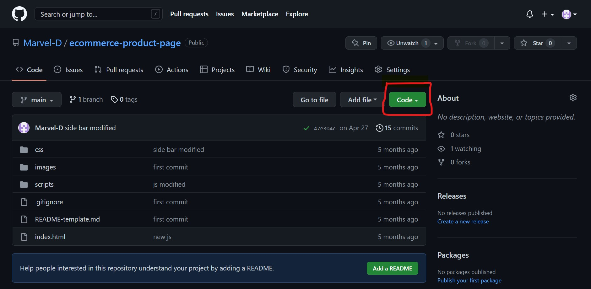
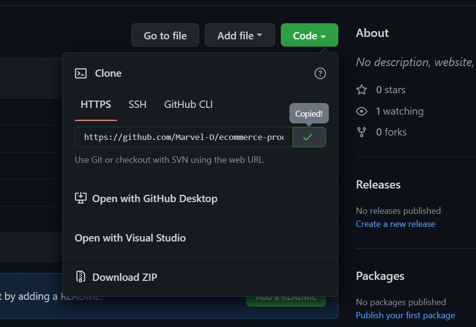
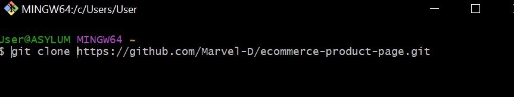
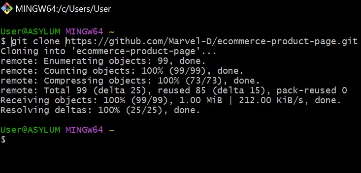

# Introduction To Github

## Table of content

- Introduction
- What is Github
- Why Github
- Git vs Github
- how to Clone a repository from github
- how to make a pull request
- how to commit
- GitHub Desktop vs Github CLI
- Conclusion

## Introduction

As a software project grows, it is becomes increasingly important developers to track and manage changes made to a software project’s code.
This article will take you through one of the most popular means used to accomplish this task, GitHub.

You will understand the essentials of such as repositories, commits, cloning and pull requests.

Certain requirements are nessesary for you to flow along with this article. These include

- a GitHub account
- Internet Access
- Installed Git on your local computer

visit --- to create a github account

## What is Github

For you to have a better understanding of github, you need to understand two important concepts associated with it, namely;

- Version control
- Git

**Version control**, also known as source control, is the practice of tracking and managing changes to software code.

**Git** is an open source version control system designed to handle projects of all scales with speed and efficiency. It is responsible for everything GitHub-related that happens locally on your computer.

**GitHub** is a code hosting platform for version control and collaboration. It offers a cloud-based Git repository hosting service which allows you and others work together on projects from anywhere.

It essentially makes it a lot easier for individuals and teams to use Git for version control and collaboration.

> A Github repository is a container of all your project's files and each file's revision history

## Why Github

...

## Git vs Github

Git is a version control system that lets you manage and keep track of your source code history whereas, GitHub is a cloud-based hosting service that lets you manage Git repositories.
If you have open-source projects that use Git, then GitHub is designed to help you better manage them.

Another difference to note is that giy is installed and maintained on your local system while GitHub is exclusively cloud based

## How to Clone a repository from github

The act of cloning a github repository refers to the process of copying the repository from github to your local machine. In essence, by cloning a repository, you create a local copy of your project on which new changes and alterations could be made and synced between the two storage locations (i.e cloud and local)

This is usually done to make it easier to fix merge conflicts, add or remove files and push new commits

> find more information on these terms at ---

To clone a repository,

1. visit [GitHub.com](http://github.com/) and navigate to the main page of the repository.

2. Above the list of files, click the Code button
   

3. Copy the URL for the repository
   

4. Open Git Bash.

5. Change the current working directory(location) to the location where you want to save the cloned repository.

6. Type git clone, and then paste the URL you copied earlier
   

7. Press Enter to create your local clone.
   

## How to make a pull request

Pull requests let you tell others about changes you've pushed to a branch in a repository on GitHub. Once a pull request is opened, you can discuss and review the potential changes with collaborators and add follow-up commits before your changes are merged into the base branch.

To create a pull request,
It is assumed you have been working on the repository and have pushed your changes to Github using the `Git push` command in your terminal.

1. Once you push the changes to your repo, the Compare & pull request button will appear in GitHub.
