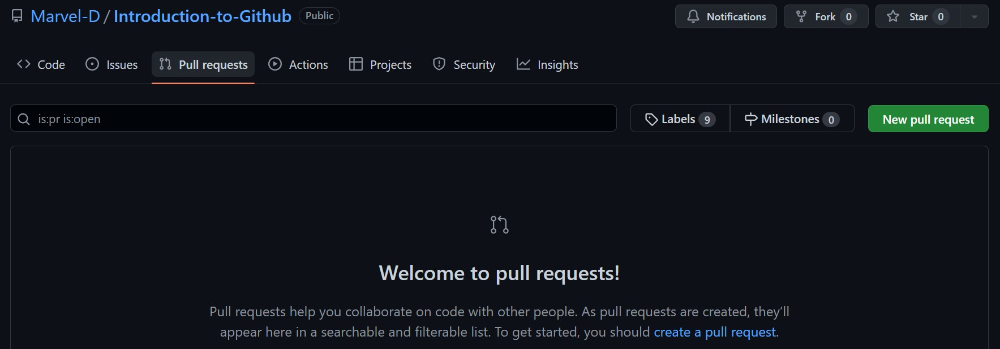
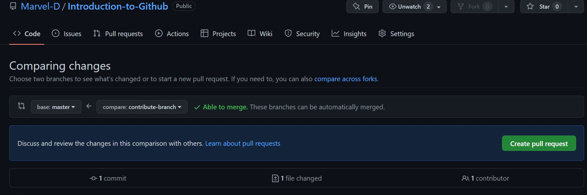

# Introduction To GitHub

## Table of content

- Introduction
- What is GitHub
- Why GitHub
- Git vs GitHub
- how to Clone a repository from GitHub
- how to make a pull request
- how to commit
- GitHub Desktop vs GitHub CLI
- Conclusion

---

## Introduction

As a software project grows, it becomes important to track and manage it.
This article will take you through one of the most popular means used to do this, **GitHub**. You will understand the basic concepts of GitHub such as repositories, commits, cloning and pull requests.

Certain requirements are necessary for you to flow along with this article. These include:

- a [GitHub account](http://github.com/)
- Internet Access
- Installed [Git](https://git-scm.com/) on your local computer

## What is GitHub

For you to have a better understanding of GitHub, you need to understand two important concepts associated with it,

- Version control
- Git

**Version control** is the practice of monitoring and managing changes made to a software and its code.

**Git** is an open-source version control system designed to handle projects of all sizes with speed and efficiency. It handles everything related to GitHub on your computer.

**GitHub** is a code hosting platform for version control and collaboration. It offers a cloud-based Git repository hosting service which lets you and others work together on projects from anywhere.

> A repository is a container of all your project's files and each file's revision history.

## Why GitHub

GitHub lets you and others work together on projects from anywhere around the world.
It makes it a lot easier for individuals and teams to use Git for version control and collaboration.

## Git vs GitHub

| Git                                                                                     | GitHub                                                                     |
| --------------------------------------------------------------------------------------- | -------------------------------------------------------------------------- |
| It is a version control system that lets you manage and keep track of your code history | It is a cloud-based hosting service that lets you manage Git repositories. |
| It is installed and maintained on your local machine (computer)                         | It is solely cloud-based                                                   |

## How to Clone a repository from GitHub

The act of cloning a GitHub repository refers to the process of copying the repository from GitHub to your local machine. In essence, by cloning a repository, you create a local copy of your project on which new changes and alterations are made and synced between the two storage locations (i.e. cloud and local)

This is usually done to make it easier to fix merge conflicts, add or remove files and push new commits

To clone a repository;

1. visit [GitHub.com](http://github.com/) and navigate to the repository's main page.

2. Above the list of files, click **Code**
   

3. Copy the URL for the repository
   

4. Open Git Bash on your computer.

5. Change the current working folder to the folder where you want to save the cloned repository.

6. Type `git clone, and then paste the URL you copied earlier
   

7. Press **Enter** to create your local clone. 

## How to make a pull request

Pull requests let you tell others about changes you've pushed to a branch in a repository. Once a pull request is opened, you can discuss and review the potential changes with collaborators and add follow-up **commits** before your changes are accepted.

To create a pull request;

1. Navigate to the main page of the repository.
2. select **New pull request**
   
3. select the branch you pushed your code to
4. click **Create pull request**
5. fill in the required details and **Create pull request** 

This lets the repo's maintainers review your contribution

## How to commit

A **commit** records changes made to one or more files in your repository. It is like saving a file, that's been edited, to your local repository.

To commit after making changes;

1. Navigate to the **source control** on your IDE
2. Hover over the **Changes** panel and click the **plus icon** to **stage** all your changes
   
3. open your terminal
4. type `git commit -m "your commit message"`
5. Press enter
   

> To sync these changes to your GitHub repository, type `git push` in your terminal and press **Enter** after committing

## GitHub Desktop vs Github CLI

| GitHub Desktop                                                                                                                                      | GitHub CLI                                                                    |
| --------------------------------------------------------------------------------------------------------------------------------------------------- | ----------------------------------------------------------------------------- |
| It is an application that enables interaction with GitHub via a GUI(graphical user interface) instead of using the command line or an IDE terminal. | It is an open-source tool for using GitHub from your computer's command line. |
| It is used to complete most Git commands from your desktop with visual confirmation of the changes made.                                            | It is used to save time and avoid switching between contexts.                 |

## Conclusion

In this article, you have come to understand basic concepts and terminologies including

- What GitHub is
- Why GitHub is important
- the difference between Git and GitHub
- The processes involved in:
  - Cloning a repository from GitHub
  - making a pull request and
  - committing changes to a repository
- The difference between GitHub Desktop vs Github CLI
