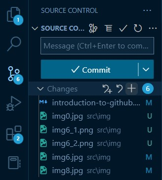
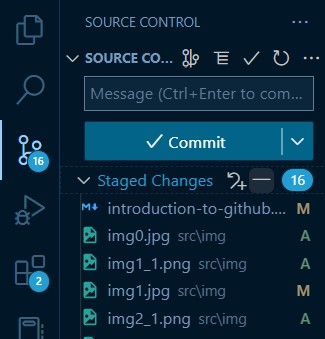

# Introduction To GitHub

## Table of content

- Introduction
- What is GitHub
- Why GitHub
- Git vs GitHub
- how to Clone a repository from GitHub
- how to make a pull request
- how to commit
- GitHub Desktop vs GitHub CLI
- Conclusion

---

## Introduction

As a software project grows, it becomes important to track and manage it.
This article will take you through one of the most popular means used to do this, **GitHub**. You will understand the basic concepts of GitHub such as repositories, commits, cloning and pull requests.

Certain requirements are necessary for you to flow along with this article:

- An Installed [Integrated development environment](https://en.wikipedia.org/wiki/Integrated_development_environment) (e.g [visual studio](https://code.visualstudio.com/download))
- You should possess a [GitHub account](http://github.com/)
- You should Install [Git](https://git-scm.com/) on your computer

## What is GitHub

For you to have a better understanding of GitHub, you need to understand two important concepts associated with it, **version control** and **Git**.

- **Version control** is the practice of monitoring and managing changes made to a software project.

- **Git** is an open-source version control system designed to handle projects of all sizes with speed and efficiency. It handles everything related to GitHub on your computer.

Haven understood the given concepts, what is GitHub?

**GitHub** is a cloud-based hosting platform for version control and collaboration.

## Why GitHub

Although GitHub is not the only code hosting platform on the web, it possess several advantages against other platforms, such as:

- GitHub lets you and others work together on projects from anywhere around the world.
- It makes it a lot easier for individuals and teams to use Git for version control and collaboration.
- Using GitHub, contributing to open source projects is made simpler
- GitHub keeps track of changes made to projects. This is especially helpful when collaborating with multiple people because you can determine who made what changes, when and where.
  > visit [opensource.guide](https://opensource.guide/starting-a-project/#:~:text=When%20a%20project%20is%20open,through%20an%20open%20source%20license.) to know more about open source projects

## Git vs GitHub

| Git                                                             | GitHub                               |
| --------------------------------------------------------------- | ------------------------------------ |
| It is focused on version control                                | It is focused on cloud-based hosting |
| It lets you manage and keep track of your code history          | It lets you manage Git repositories. |
| It is installed and maintained on your local machine (computer) | It is solely cloud-based             |
| It is an open-source software                                   | It is not an open-source software    |
| It is maintained by Linux                                       | It is owned by Microsoft             |

## How to Clone a repository from GitHub

You might be unsure of the definition of a **repository**.

A repository is a container of all your project's files and each file's revision history.

The act of cloning a GitHub repository refers to the process of copying the repository from GitHub to your local machine. In essence, by cloning a repository, you create a local copy of your project on which new changes and alterations a can be made and synced between the two storage locations (i.e. cloud and local)

This is usually done to make it easier to fix errors and add or remove files to a project.

> Read [this](https://www.geeksforgeeks.org/what-is-a-git-repository/) article to get a better understanding of repositories

To clone a repository;

1. Visit your GitHub profile and search for
   the [Marvel-D/Introduction-to-Github](https://github.com/Marvel-D/Introduction-to-Github) repository.
   

> This is the repository you will be using for this article.

2. Click **Code**.
   

3. Copy the URL(link) for the repository.
   

4. Open Git Bash on your computer.

   > Read [**this**](https://www.codecademy.com/article/command-line-setup) article to know how to open Git Bash on your computer.

5. Change the current folder location to the folder where you want to save the cloned repository.

   > Read [this](https://www.git-tower.com/learn/git/ebook/en/command-line/appendix/command-line-101#:~:text=To%20change%20this%20current%20working,%24%20cd%20..) article to learn how to change the current folder location on your terminal.

6. Type `git clone`, and then paste the URL you copied earlier.
   

7. Press **Enter** to create your local clone. 

## How to make a pull request

Pull requests let you tell others about changes you've pushed to a branch in a repository. Once a pull request is opened, you can discuss and review the potential changes with collaborators.

To create a pull request;

> Before making a pull request, you should Forked the repository and made changes to it's files. Visit [docs.github](https://docs.github.com/en/get-started/quickstart/fork-a-repo) to learn how to fork a repository

1. On to the main page of the [Marvel-D/Introduction-to-Github](https://github.com/Marvel-D/Introduction-to-Github) repository, select **New pull request**
   
2. Choose the branch where your code was pushed.
   
3. Click **Create pull request**
   
4. Fill in the required details and **Create pull request** 

## How to commit

A **commit** records changes made to one or more files in your repository. It is like saving a file, that's been edited, to your local repository.

To commit after making changes;

1. Navigate to the **source control** on your IDE.
   
   > I will be using Visual Studio Code as my IDE.
2. Hover over the **Changes** panel and click the **plus icon**. This will prepare the files you edited for a commit. This process is known as **staging**.
   
3. open your terminal
   
4. type `git commit -m "your commit message"` into the opened terminal
   
5. Press enter
   

> To sync these changes to your GitHub repository, type `git push` in your terminal and press **Enter** after committing

## GitHub Desktop vs Github CLI

| GitHub Desktop                                                                                                                                        | GitHub CLI                                                                    |
| ----------------------------------------------------------------------------------------------------------------------------------------------------- | ----------------------------------------------------------------------------- |
| It is an application that enables interaction with GitHub via a GUI(graphical user interface) instead of using the command line or an IDE's terminal. | It is an open-source tool for using GitHub from your computer's command line. |
| It is used to complete most Git commands from your desktop with visual confirmation of the changes made.                                              | It is used to save time and avoid switching between contexts.                 |

## Conclusion

In this article, you have come to understand basic processes and terminologies associated with GitHub including:

- What GitHub is
- Why GitHub is important
- the difference between Git and GitHub
- The processes involved in:
  - Cloning a repository from GitHub
  - making a pull request and
  - committing changes to a repository
- The difference between GitHub Desktop vs Github CLI
